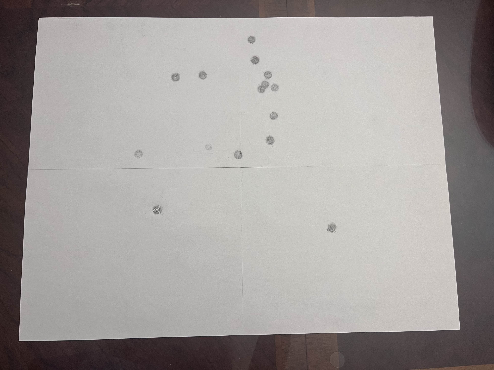

# MAPS

MAPS aims to be a tool for quickly, precisely, and repeatably quantifying the accuracy of nerf blasters.

# How it works

Here's the general idea:
1. Tape a rectangular target of white paper to a wall.
2. Hang a layer of carbon (not carbonless) copy paper over the target. You may need to put another layer of (normal) paper over the carbon paper in order to prevent it from tearing.
3. Shoot darts at the target. The darts will leave marks on the paper target when they hit the layer of carbon paper. Here's what that looks like: 
4. Take a good picture of the target (like the one above).
5. Run that picture through MAPS. MAPS will compute the location of the dots on the target and do some math to quantify the accuracy of the blaster.

# Build

Initial setup:
```bash
meson setup builddir
```

Compilation:
```bash
cd builddir
meson compile
src/MAPS <path_to_image> # run the program
```

# License

Mark's Awesome Precision Suite

Copyright (C) 2023-2024 Mark Ghebrial

This program is free software: you can redistribute it and/or modify it under the terms of the GNU General Public License as published by the Free Software Foundation, either version 3 of the License, or (at your option) any later version.

This program is distributed in the hope that it will be useful, but WITHOUT ANY WARRANTY; without even the implied warranty of MERCHANTABILITY or FITNESS FOR A PARTICULAR PURPOSE. See the GNU General Public License for more details.

You should have received a copy of the GNU General Public License along with this program. If not, see https://www.gnu.org/licenses/.